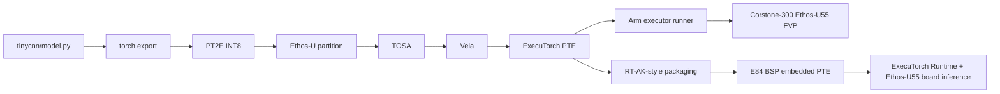

# Ethos-U TinyCNN ExecuTorch Deployment

## 1. Project Summary

This tree records two connected phases of the TinyCNN ExecuTorch + Ethos-U55 work.

- Phase 1, `zwb725/tinycnn`: custom TinyCNN model, PT2E INT8, TOSA/Vela, PTE generation, Corstone-300 Ethos-U55 FVP validation, and an RT-AK-style packaging prototype.
- Phase 2, `zwb725/tinycnn-edgi_talk`: PSoC Edge E84 BSP integration, real ExecuTorch Runtime lifecycle, Ethos-U55 board inference, IRQ/RT-Thread semaphore return path, and final E84/FVP numerical comparison.

TinyCNN is a random fixed-weight classification benchmark for deployment validation. It is not a real gesture-recognition model and this project does not claim real dataset accuracy or production-grade stability.

## 2. Current Final Status

| Item | Status | Evidence |
| --- | --- | --- |
| PT2E INT8 | PASS | `tinycnn/reports/quantization_report.md` |
| TOSA/Vela | PASS | `tinycnn/reports/delegation_report.md` |
| FVP | PASS | `tinycnn/reports/fvp_validation_report.md` |
| PTE C array | PASS | `rtak_plugin_executorch/examples/tinycnn/generated/embedded/` |
| E84 ExecuTorch Runtime | PASS | `docs/12_first_inference_journey.md` |
| Ethos-U55 board inference | PASS | `docs/12_first_inference_journey.md` |
| IRQ/RT-Thread Semaphore | PASS | `docs/12_first_inference_journey.md` |
| E84/FVP Top-1 comparison | PASS | `tinycnn/reports/e84_fvp_final_validation.md` |
| 1e-6 numerical consistency | PASS | `scripts/validate_e84_fvp_output.py` |
| Float Bit-Exact | Not verified | FVP log prints decimal floats, not full float bits. |
| Real dataset accuracy | Not applicable | TinyCNN uses fixed random weights. |
| Production-grade stability | Not verified | Single fixed-input validation, not stress testing. |

Final comparison:

```text
TINYCNN_E84_FVP_FINAL_COMPARE=PASS
```

## 3. Current Numerical Evidence

| Item | Value |
| --- | --- |
| Baseline PTE | `tinycnn/build/tinycnn_u55.pte`, `31696 bytes` |
| ExecuTorch Header | `ET12` |
| FNV-1a32 | `0xdc0bdb6e` |
| SHA256 | `5523dd345ee3b99dab80a454cb039f79d4484d3c19a4d1700332959d50b654c2` |
| FVP output | `[-0.020373, 0.067080, -0.059627, 0.062111]` |
| E84 float bits | `0xbca6e43b`, `0x3d896156`, `0xbd743b44`, `0x3d7e6867` |
| E84 decoded output | `[-0.0203725006, 0.0670801848, -0.0596268326, 0.0621112846]` |
| E84 Top-1 / FVP Top-1 | `1` / `1` |
| Max abs error | `4.993568659e-07` |
| Tolerance | `1e-6` |

## 4. Architecture



## 5. TinyCNN Network

`Input [1,3,96,96] -> Conv/ReLU -> Conv/ReLU -> Conv/ReLU -> AdaptiveAvgPool2d -> Flatten -> Linear -> Output [1,4]`

Parameter count: `23844`. Layer details are in `docs/01_tinycnn_model.md`.

## 6. Environment Versions

- WSL2 Ubuntu
- Python virtual environment: `/home/zwb/work/ethosu_tinycnn/.venv`
- ExecuTorch checkout: `/home/zwb/work/ethosu_tinycnn/executorch`
- ExecuTorch: `v1.3.1`
- PyTorch: `2.13.0+cpu`
- Vela: `5.0.0`
- Arm GNU Toolchain: `15.2.Rel1`
- Target: `ethos-u55-128`
- Validation FVP: `FVP_Corstone_SSE-300_Ethos-U55`
- E84 BSP workspace: `C:\tinycnn\Edgi_Talk_M55_DEEPCRAFT_Deploy_Vision`

## 7. Setup

```bash
cd /home/zwb/work/ethosu_tinycnn
source .venv/bin/activate
source executorch/examples/arm/arm-scratch/setup_path.sh
```

## 8. Export Commands

The protected baseline PTE is `tinycnn/build/tinycnn_u55.pte`. Re-running the original baseline exporter can overwrite it, so reproducible optimization exports use independent directories:

```bash
python -m tinycnn.export_variants --variant default --input-size 96
python -m tinycnn.export_variants --variant size --input-size 96 --optimise Size
python -m tinycnn.export_variants --variant input_64 --input-size 64
```

## 9. FVP Run Command

```bash
FVP_Corstone_SSE-300_Ethos-U55 \
  -C ethosu.num_macs=128 \
  -C mps3_board.visualisation.disable-visualisation=1 \
  -C mps3_board.telnetterminal0.start_telnet=0 \
  -C mps3_board.uart0.out_file="-" \
  -C mps3_board.uart0.shutdown_on_eot=1 \
  -C cpu0.semihosting-enable=1 \
  -a /home/zwb/work/ethosu_tinycnn/tinycnn/build/variants/default/runner/arm_executor_runner \
  --timelimit 120
```

QSPI mode uses the runner built with `--pte=0x38000000` and adds `--data /home/zwb/work/ethosu_tinycnn/tinycnn/build/tinycnn_u55.pte@0x38000000`.

## 10. E84/FVP Final Validation Command

Run from `C:\tinycnn`:

```powershell
python tinycnn-executorch/scripts/validate_e84_fvp_output.py `
    --fvp-log tinycnn-executorch/tinycnn/reports/fvp_e84_final_compare.log `
    --e84-log tinycnn-executorch/tinycnn/reports/e84_first_inference_serial.log `
    --tolerance 1e-6
```

Expected final line:

```text
TINYCNN_E84_FVP_FINAL_COMPARE=PASS
```

## 11. E84 BSP Reproduction Dependency

`Edgi_Talk_M55_DEEPCRAFT_Deploy_Vision/applications/rt_ai_tinycnn_executorch/SConscript` still has a compatible default dependency on the WSL ExecuTorch workspace:

```text
//wsl$/Ubuntu-22.04/home/zwb/work/ethosu_tinycnn
```

The path can be overridden without changing the project file:

```powershell
$env:EXECUTORCH_WS_ROOT='//wsl$/Ubuntu-22.04/home/zwb/work/ethosu_tinycnn'
```

The GitHub repository may not contain a complete standalone copy of all ExecuTorch static libraries. Before rebuilding the E84 BSP, build the runner and related `.a` files in WSL, including `libexecutorch.a`, `libexecutorch_core.a`, `libexecutorch_delegate_ethos_u.a`, portable/quantized kernel libraries, and `libethosu_core_driver.a`.

## 12. Known Limits

- E84/FVP agreement is numerical within `1e-6`, not Float Bit-Exact.
- `37 ms` is `Method::execute()` end-to-end elapsed time on E84, not pure NPU latency.
- TinyCNN has no dataset accuracy claim.
- Current validation uses one fixed input and fixed random weights.
- This is not a generic production RT-AK Backend release.
- Production-grade stability remains unverified.

## 13. Document Index

- `docs/00_project_overview.md`
- `docs/01_tinycnn_model.md`
- `docs/02_executorch_pt2e_pipeline.md`
- `docs/03_tosa_vela_delegation.md`
- `docs/04_fvp_runner_validation.md`
- `docs/05_fvp_debugging_cases.md`
- `docs/06_vela_optimization.md`
- `docs/07_linker_layout_analysis.md`
- `docs/08_rtak_backend_prototype.md`
- `docs/09_multi_runtime_architecture.md`
- `docs/10_resume_and_interview.md`
- `docs/12_first_inference_journey.md`
- `docs/13_e84_fvp_final_validation.md`
- `docs/STATUS.md`
- `tinycnn/reports/e84_fvp_final_validation.md`
- `tinycnn/reports/fvp_e84_final_compare.log`
- `tinycnn/reports/e84_first_inference_serial.log`
- `scripts/validate_e84_fvp_output.py`