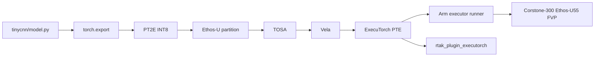

# Ethos-U TinyCNN ExecuTorch Deployment

## 1. Project Summary

This repository validates a custom TinyCNN through ExecuTorch, TOSA, Vela, PTE generation, Cortex-M55 runner build, and Corstone-300 Ethos-U55 FVP execution. It also includes an RT-AK-style prototype for packaging a validated ExecuTorch PTE.

This project does not claim a PSoC Edge E84 ExecuTorch Runtime port. TinyCNN is a random-weight classification benchmark, not a real gesture-recognition model.

## 2. Current Status

| Item | Value | Evidence |
| --- | --- | --- |
| Model | Custom TinyCNN, random fixed weights | `tinycnn/model.py` |
| Parameters | 23844 | `tinycnn/build/fp32_recheck.log` |
| Input / output | `(1, 3, 96, 96)` -> `(1, 4)` | `tinycnn/reports/baseline_summary.md` |
| FP32 vs INT8 Top-1 | `1` vs `1` | `tinycnn/reports/quantization_report.md` |
| Fixed-input max abs error | `0.00024946779012680054` | `tinycnn/reports/quantization_report.md` |
| Delegate | 1 subgraph, 29 delegated EXIR nodes | `tinycnn/reports/delegation_report.md` |
| Vela ops | 7 NPU operators, 0 CPU operators | `tinycnn/reports/delegation_report.md` |
| Baseline PTE | `tinycnn/build/tinycnn_u55.pte`, 31696 bytes | `tinycnn/reports/baseline_artifacts.sha256` |
| FVP | embedded-PTE PASS, QSPI `--data` PASS | `tinycnn/reports/fvp_validation_report.md` |

## 3. Architecture



## 4. TinyCNN Network

`Input [1,3,96,96] -> Conv/ReLU -> Conv/ReLU -> Conv/ReLU -> AdaptiveAvgPool2d -> Flatten -> Linear -> Output [1,4]`

Parameter count: `23844`. Layer details are in `docs/01_tinycnn_model.md`.

## 5. Environment Versions

- WSL2 Ubuntu
- Python virtual environment: `/home/zwb/work/ethosu_tinycnn/.venv`
- ExecuTorch checkout: `/home/zwb/work/ethosu_tinycnn/executorch`
- ExecuTorch: `v1.3.1`
- PyTorch: `2.13.0+cpu`
- Vela: `5.0.0`
- Arm GNU Toolchain: `15.2.Rel1`
- Target: `ethos-u55-128`
- Validation FVP: `FVP_Corstone_SSE-300_Ethos-U55`

## 6. Setup

```bash
cd /home/zwb/work/ethosu_tinycnn
source .venv/bin/activate
source executorch/examples/arm/arm-scratch/setup_path.sh
```

## 7. FP32 Smoke Test

```bash
python tinycnn/test_fp32.py
```

## 8. Export Commands

The protected baseline PTE is `tinycnn/build/tinycnn_u55.pte`. Re-running the original baseline exporter can overwrite it, so the reproducible optimization exports use independent directories:

```bash
python -m tinycnn.export_variants --variant default --input-size 96
python -m tinycnn.export_variants --variant size --input-size 96 --optimise Size
python -m tinycnn.export_variants --variant input_64 --input-size 64
```

## 9. Runner Build Command

Example for the default variant, matching the validated build configuration:

```bash
./executorch/backends/arm/scripts/build_executor_runner.sh \
  --pte=/home/zwb/work/ethosu_tinycnn/tinycnn/build/variants/default/tinycnn_default.pte \
  --target=ethos-u55-128 \
  --build_type=Release \
  --system_config=Ethos_U55_High_End_Embedded \
  --memory_mode=Shared_Sram \
  --output=/home/zwb/work/ethosu_tinycnn/tinycnn/build/variants/default/runner \
  --extra_build_flags="-DEXECUTORCH_BUILD_CORTEX_M=OFF -DCMSIS_VER=5 -DCMSIS_PATH=/home/zwb/work/ethosu_tinycnn/executorch/examples/arm/arm-scratch/ethos-u/core_software/cmsis -DTINYCNN_FVP_SEMIHOSTING=ON -DTINYCNN_FVP_TRACE_SETUP=ON -DTINYCNN_FVP_TRACE_RUNNER=ON"
```

## 10. FVP Run Command

```bash
FVP_Corstone_SSE-300_Ethos-U55 \
  -C ethosu.num_macs=128 \
  -C mps3_board.visualisation.disable-visualisation=1 \
  -C mps3_board.telnetterminal0.start_telnet=0 \
  -C mps3_board.uart0.out_file="-" \
  -C mps3_board.uart0.shutdown_on_eot=1 \
  -C cpu0.semihosting-enable=1 \
  -a /home/zwb/work/ethosu_tinycnn/tinycnn/build/variants/default/runner/arm_executor_runner \
  --timelimit 120
```

QSPI mode uses the runner built with `--pte=0x38000000` and adds `--data /home/zwb/work/ethosu_tinycnn/tinycnn/build/tinycnn_u55.pte@0x38000000`.

## 11. Optimization Commands

```bash
python -m tinycnn.summarize_variants
```

Outputs:

- `tinycnn/reports/optimization_results.csv`
- `tinycnn/reports/vela_optimization_report.md`

## 12. RT-AK Backend CLI Example

```bash
PYTHONPATH=rtak_plugin_executorch python -m rt_ai_tools.platforms.executorch_ethosu.cli \
  --pte /home/zwb/work/ethosu_tinycnn/tinycnn/build/tinycnn_u55.pte \
  --project /home/zwb/work/ethosu_tinycnn/rtak_plugin_executorch/examples/tinycnn/generated/embedded \
  --model-name tinycnn \
  --input-shape 1,3,96,96 \
  --output-shape 1,4 \
  --target ethos-u55-128 \
  --load-mode embedded \
  --force
```

## 13. Real Results

| variant | input | PTE bytes | SRAM KiB | Flash KiB | FVP | FVP output | PMU cycles |
| --- | --- | --- | --- | --- | --- | --- | --- |
| default | (1, 3, 96, 96) | 31712 | 78.203125 | 25.328125 | PASS | [-0.020373, 0.067080, -0.059627, 0.062111] | Corstone-300 FVP ethosu_pmu_cycle_cntr=247546; not E84 board timing |
| size | (1, 3, 96, 96) | 36432 | 54 | 25.328125 | PASS | [-0.020373, 0.067080, -0.059627, 0.062111] | Corstone-300 FVP ethosu_pmu_cycle_cntr=475583; not E84 board timing |
| input_64 | (1, 3, 64, 64) | 31120 | 48.21875 | 25.34375 | PASS | [-0.020281, 0.067272, -0.058863, 0.060842] | Corstone-300 FVP ethosu_pmu_cycle_cntr=119909; not E84 board timing |

## 14. Directory Structure

```text
tinycnn/
  model.py
  export_ethosu.py
  export_variants.py
  summarize_variants.py
  build/
  reports/
rtak_plugin_executorch/
  rt_ai_tools/platforms/executorch_ethosu/
  backend_executorch/
  examples/tinycnn/generated/
  tests/
  reports/
docs/
```

## 15. Fixed Issues

- Enabled Cortex-M55 FPU/MVE before FVP runner execution.
- Fixed semihost inline assembly register clobber handling.
- Added guarded runner/target traces and semihost retarget paths.
- Disabled unstable Cortex-M/CMSIS-NN dependency path for this environment while keeping the Ethos-U delegate path validated.

## 16. Known Limits

- Linker warnings remain and are analyzed in `tinycnn/reports/linker_layout_analysis.md`.
- FVP counters are not E84 board performance.
- TinyCNN has no dataset accuracy claim.
- RT-AK backend target code is a porting stub until a real ExecuTorch Runtime integration is added.

## 17. Document Index

- `docs/00_project_overview.md`
- `docs/01_tinycnn_model.md`
- `docs/02_executorch_pt2e_pipeline.md`
- `docs/03_tosa_vela_delegation.md`
- `docs/04_fvp_runner_validation.md`
- `docs/05_fvp_debugging_cases.md`
- `docs/06_vela_optimization.md`
- `docs/07_linker_layout_analysis.md`
- `docs/08_rtak_backend_prototype.md`
- `docs/09_multi_runtime_architecture.md`
- `docs/10_resume_and_interview.md`
- `docs/STATUS.md`
