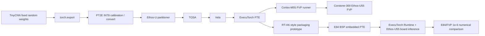

# Project Overview

## Background

This workspace validates a custom TinyCNN deployment chain across ExecuTorch, TOSA, Vela, and Ethos-U55 targets. The project now has two clearly separated phases:

1. `zwb725/tinycnn` completed the model, PT2E INT8, TOSA/Vela, PTE, FVP runner validation, and RT-AK-style packaging prototype.
2. `zwb725/tinycnn-edgi_talk` completed the PSoC Edge E84 BSP integration, real ExecuTorch Runtime lifecycle, Ethos-U55 board inference, and final E84/FVP numerical comparison.

## Goals

- Build a custom model path instead of depending on an ExecuTorch example model.
- Preserve baseline artifacts with hash, logs, and FVP evidence.
- Compare Vela resource tradeoffs using real generated PTEs and logs.
- Provide an RT-AK-style packaging prototype for manifest, embedded C array, and QSPI resource modes.
- Record the later E84 BSP-specific runtime integration without rewriting it as a generic production RT-AK Backend.
- Keep verified results, historical blocked states, and remaining limits separate.

## Completed Scope

| Item | Value / Status | Evidence |
| --- | --- | --- |
| Model | Custom TinyCNN, fixed random weights | `tinycnn/model.py` |
| Parameters | 23844 | `tinycnn/build/fp32_recheck.log` |
| Input / output | `(1, 3, 96, 96)` -> `(1, 4)` | `tinycnn/reports/baseline_summary.md` |
| FP32 vs INT8 Top-1 | `1` vs `1` | `tinycnn/reports/quantization_report.md` |
| Fixed-input max abs error | `0.00024946779012680054` | `tinycnn/reports/quantization_report.md` |
| Delegate | 1 subgraph, 29 delegated EXIR nodes | `tinycnn/reports/delegation_report.md` |
| Vela ops | 7 NPU operators, 0 CPU operators | `tinycnn/reports/delegation_report.md` |
| Baseline PTE | `tinycnn/build/tinycnn_u55.pte`, 31696 bytes | `tinycnn/reports/baseline_artifacts.sha256` |
| FVP | embedded-PTE PASS, QSPI `--data` PASS | `tinycnn/reports/fvp_validation_report.md` |
| E84 ExecuTorch Runtime | PASS in `tinycnn-edgi_talk` | `docs/12_first_inference_journey.md` |
| E84/FVP numerical comparison | PASS | `tinycnn/reports/e84_fvp_final_validation.md` |

## Remaining Limits

- The original `zwb725/tinycnn` stage did not include a completed E84 Runtime port; that historical state was correct at the time.
- The follow-up `zwb725/tinycnn-edgi_talk` stage completed the BSP-specific E84 runtime path and board inference.
- E84/FVP agreement is numerical within `1e-6`; Float Bit-Exact is not verified.
- `37 ms` is `Method::execute()` end-to-end elapsed time, not pure NPU latency.
- TinyCNN has no real gesture-recognition accuracy claim because it uses fixed random weights.
- Linker warnings were analyzed, but production firmware layout cleanup remains outside this closure.
- Production-grade stability has not been verified.

## Architecture

