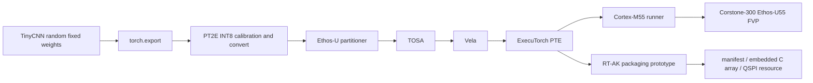

# Project Overview

## Background

This workspace validates a custom TinyCNN deployment chain through ExecuTorch, TOSA, Vela, and an Ethos-U55 FVP target. It also adds a minimal RT-AK-style packaging prototype for an ExecuTorch PTE.

## Goals

- Build a custom model path instead of relying on ExecuTorch official example models.
- Keep a protected baseline with hashes, logs, and FVP evidence.
- Compare Vela resource tradeoffs with real generated PTEs and logs.
- Create a PC-side RT-AK prototype that packages a PTE into manifest, embedded, or QSPI resource modes.
- Document what is validated and what remains outside scope.

## Completed Scope

| Item | Value | Evidence |
| --- | --- | --- |
| Model | Custom TinyCNN, random fixed weights | `tinycnn/model.py` |
| Parameters | 23844 | `tinycnn/build/fp32_recheck.log` |
| Input / output | `(1, 3, 96, 96)` -> `(1, 4)` | `tinycnn/reports/baseline_summary.md` |
| FP32 vs INT8 Top-1 | `1` vs `1` | `tinycnn/reports/quantization_report.md` |
| Fixed-input max abs error | `0.00024946779012680054` | `tinycnn/reports/quantization_report.md` |
| Delegate | 1 subgraph, 29 delegated EXIR nodes | `tinycnn/reports/delegation_report.md` |
| Vela ops | 7 NPU operators, 0 CPU operators | `tinycnn/reports/delegation_report.md` |
| Baseline PTE | `tinycnn/build/tinycnn_u55.pte`, 31696 bytes | `tinycnn/reports/baseline_artifacts.sha256` |
| FVP | embedded-PTE PASS, QSPI `--data` PASS | `tinycnn/reports/fvp_validation_report.md` |

## Not Completed Scope

- No PSoC Edge E84 ExecuTorch Runtime port is claimed.
- No real gesture-recognition accuracy is claimed for TinyCNN; weights are random and fixed for compiler validation.
- Linker warnings are analyzed but not cleaned as production firmware layout.
- FVP PMU counters are not E84 board timing.

## Architecture

