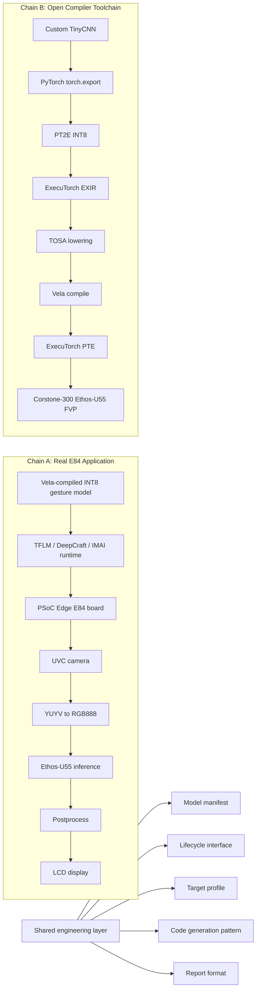

# Multi-Runtime Architecture

This project is best described as two related but separate backend chains under one deployment theme. They share packaging ideas and interface concepts, but they do not share the same runtime, model artifact, platform validation, or performance baseline.

## What Is Shared

- A model manifest can describe task, tensor shapes, quantization, target profile, artifact hash, and validation platform.
- A lifecycle interface can normalize `init`, `get_input`, `run`, `get_output`, and `deinit`.
- A target profile can capture accelerator, memory mode, and validation notes.
- Code generation can package model resources for embedded arrays or external storage.
- Reports can use a common evidence-first format.

## What Is Not Shared

- Chain A records the E84 board application/runtime path; Chain B records the ExecuTorch PTE and Corstone-300 FVP path. The later `tinycnn-edgi_talk` closure connects them through E84/FVP numerical comparison.
- The model artifacts are different: Vela/TFLite/IMAI resources versus ExecuTorch PTE.
- The current project does not run the same model through both runtimes for a fair performance comparison.
- In the original `zwb725/tinycnn` phase, ExecuTorch Runtime was not ported to E84; the follow-up `zwb725/tinycnn-edgi_talk` phase completed the BSP-specific E84 runtime path and board inference.
- Latency from different models, runtimes, and platforms must not be compared directly.
